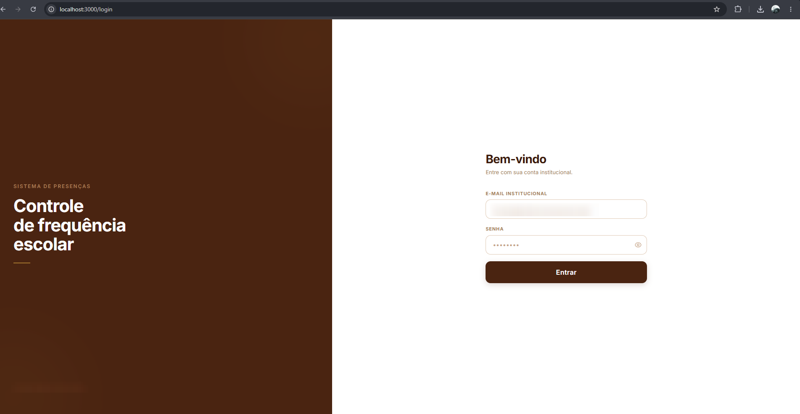
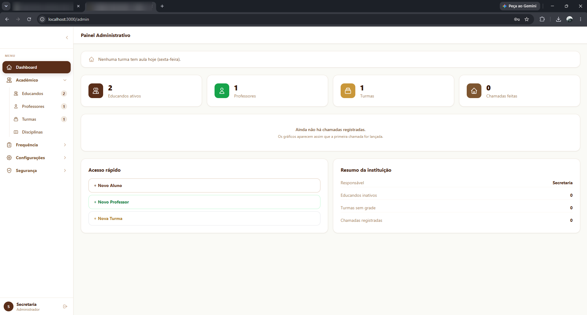
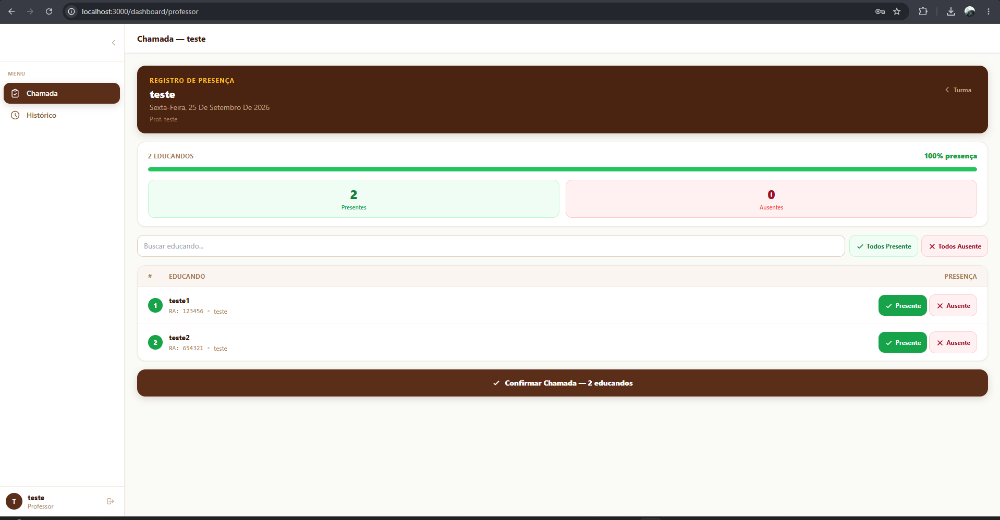
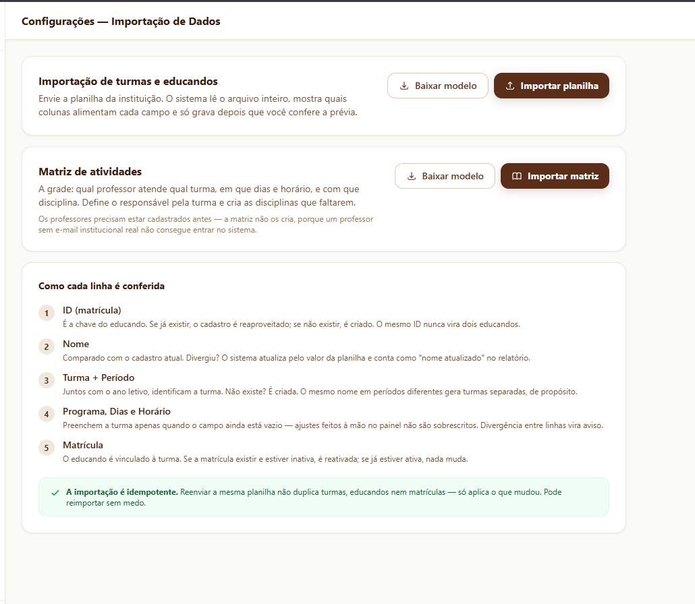
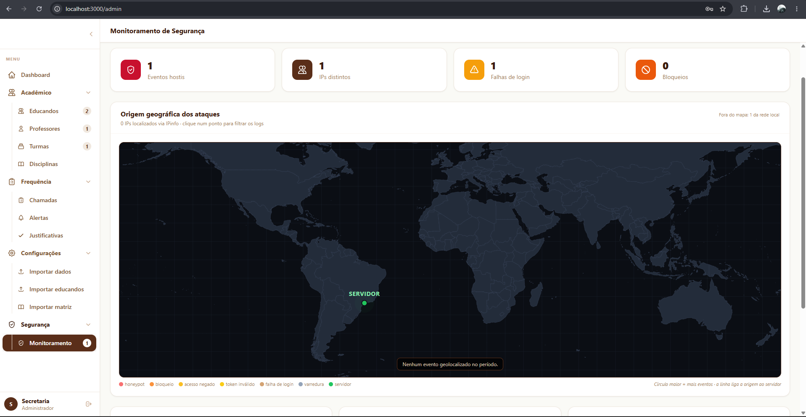

# Sistema de Presença Escolar

> Plataforma web completa para controle de frequência de educandos, desenvolvida para uso real em uma instituição de ensino**.

O código-fonte deste projeto é mantido em repositório privado. Este repositório apresenta a visão geral do sistema, as decisões de arquitetura e as tecnologias utilizadas.

---

## O problema

A chamada era feita em papel e consolidada manualmente em planilhas. Isso trazia retrabalho da secretaria, atraso para identificar alunos com baixa frequência, perda de registros e nenhuma rastreabilidade sobre quem alterou o quê.

## A solução

Um sistema web interno, usado por **professores** e pela **secretaria**, que cobre todo o ciclo da frequência:

- **Cadastro e importação em massa** de educandos e da matriz de atividades por planilha (`.xlsx` / `.csv`), com assistente de mapeamento de colunas, pré-visualização antes de gravar e reimportação sem duplicar dados
- **Lançamento de chamada** pelo professor, com atualização em tempo real no painel da secretaria
- **Ata de chamada em PDF**, gerada automaticamente e enviada para armazenamento em nuvem (S3 + CDN), sem travar o professor
- **Fluxo de justificativas**: faltas podem ser justificadas e abonadas pela secretaria, com registro de quem aprovou e quando
- **Dashboard com indicadores** de frequência por turma, unidade e período
- **Painel de segurança** com monitoramento de tentativas de login, acessos negados e varreduras, incluindo **mapa geográfico da origem dos ataques**

---

## Telas

### Login


### Dashboard da secretaria


### Lançamento de chamada


### Importação por planilha


### Painel de segurança


---

## Stack

### Frontend
| Tecnologia | Uso |
|---|---|
| **React 18** + **TypeScript** | Interface e tipagem estática |
| **Vite** | Build e ambiente de desenvolvimento |
| **Tailwind CSS** | Estilização |
| **React Router** | Roteamento e rotas protegidas por papel |
| **Axios** | Cliente HTTP com renovação automática de token |
| **Socket.IO Client** | Atualizações em tempo real |
| **Recharts** | Gráficos do dashboard |
| **react-simple-maps** + **d3-geo** | Mapa-múndi de eventos de segurança |
| **Framer Motion** | Animações e transições |

### Backend
| Tecnologia | Uso |
|---|---|
| **Node.js** + **TypeScript** | Runtime e tipagem |
| **Express** | API REST e middlewares |
| **Prisma ORM** | Acesso a dados e migrações versionadas |
| **Socket.IO** + **Redis Adapter** | Eventos em tempo real, escaláveis entre instâncias |
| **Redis (ioredis)** | Cache compartilhado, rate limit e idempotência |
| **JWT (RS256)** | Autenticação com chaves assimétricas |
| **bcrypt** | Hash de senhas |
| **LDAP (ldapjs)** | Integração com Active Directory corporativo |
| **ExcelJS** / **csv-parse** | Leitura e geração de planilhas |
| **PDFKit** | Geração das atas de chamada |
| **AWS SDK (S3)** | Armazenamento de documentos |
| **Vitest** | Testes automatizados |

### Banco de dados
| | |
|---|---|
| **SQLite** (modo WAL) | Ambiente de instância única |
| **MySQL 8** (InnoDB, utf8mb4) | Produção com alta disponibilidade |

O sistema suporta **os dois bancos**, com schema dimensionado para cada dialeto, validação automática de compatibilidade na inicialização e ferramenta própria de **migração de dados idempotente** entre eles.

### Infraestrutura
| | |
|---|---|
| **AWS Lightsail** | Hospedagem da aplicação |
| **MySQL gerenciado** | Banco com alta disponibilidade |
| **S3 + CDN** | Atas em PDF e backups |
| **Nginx** + **Certbot** | Proxy reverso e HTTPS |
| **systemd** | Gerenciamento do serviço |
| **IPinfo** | Geolocalização de IPs no monitoramento |

---

## Arquitetura

O backend segue uma **arquitetura em camadas**, separando responsabilidades de forma clara:

```
Controllers   →  entrada HTTP: validação e tradução da requisição
Services      →  regras de negócio
Repositories  →  acesso ao banco via Prisma
Middlewares   →  autenticação, RBAC, rate limit, idempotência, multi-instituição
Strategies    →  provedores de autenticação (local e LDAP)
```

O frontend é organizado em páginas por perfil (Secretaria e Professor), contextos globais de autenticação e notificações, e uma camada de serviços que centraliza a comunicação com a API.

---

## Segurança

Segurança foi tratada como requisito, não como detalhe:

- **JWT RS256** com validação de emissor/audiência, access token curto (15 min) e **refresh token com rotação**
- **RBAC** por papel e por dono do recurso
- **Isolamento multi-instituição** derivado do token, nunca do corpo da requisição
- **Autenticação via Active Directory** com validação de certificado
- **Rate limiting** no login e em rotas sensíveis, com bloqueio progressivo
- **Middleware de idempotência** que evita chamadas duplicadas mesmo com requisições simultâneas
- **WebSocket autenticado** e segmentado por salas (instituição / administradores)
- **Monitoramento de segurança** em tempo real com geolocalização e visualização em mapa
- Dependências auditadas, com correção de vulnerabilidades transitivas

---

## Decisões técnicas em destaque

- **Processamento assíncrono de PDFs**: a ata é gerada *depois* da resposta ao professor; uma falha não invalida a chamada, fica registrada e pode ser reprocessada.
- **Importação resiliente**: aceita formatos variados de dias, períodos e horários vindos de planilhas reais ("SEG-QUA", "2ª e 4ª feira", "08h às 11h20"...), normalizando tudo antes de gravar.
- **Prevenção de duplicidade**: índices únicos e rotina de fusão de turmas cadastradas com grafias diferentes.
- **Fuso horário explícito**: agregações diárias consideram o fuso de Brasília, evitando que turmas noturnas "caiam" no dia seguinte em servidores UTC.
- **Pronto para escalar horizontalmente**: estado compartilhado (cache, sessões de socket, idempotência) via Redis.
- **Backups consistentes** com envio automático para S3 e política de retenção.
- **Testes automatizados** cobrindo autenticação, chamada e importação, executando contra o banco em uso.

---

## Perfis de acesso

| Perfil | Acesso |
|---|---|
| **Secretaria (Admin)** | Cadastros, importações, relatórios, justificativas e painel de segurança |
| **Professor** | Turmas da sua unidade, lançamento de chamada e acompanhamento de frequência |

---

## Contato

Quer conhecer mais detalhes técnicos ou ver o sistema funcionando? Fique à vontade para entrar em contato.

**LykDev - Matheus** — [GitHub](https://github.com/lykdev) · [discord](npmrote) · [E-mail](radianteato5@gmail.com)
